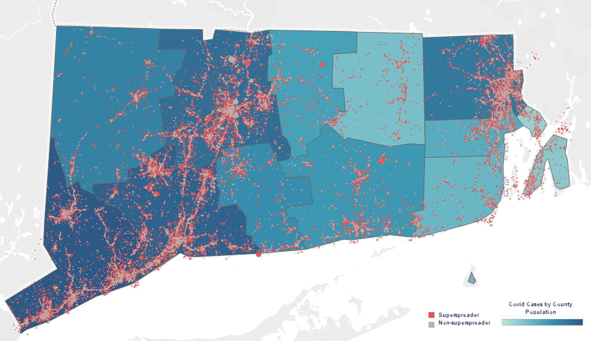

<h1 align=center>Reopening of Super-Spreader Businesses and Risk of COVID-19 Transmission</h1>

<h2 align=center>Track D, Team 6:</h2>

<h3>Participants: </h3>

Ashley O’Donoghue, PhD 
Tenzin Dechen, MPH 
Whitney Pavlova 
Dr GARBA Moussa 
Manvi Madan, MS 
Michael Boals, MS 

<h4>Mentors:</h4>

Frank DeFalco 
Aalok Thakkar

<h2>Research Question</h2>

Are counties with a higher concentration of super-spreader businesses associated with increased risk of COVID-19 transmission?
 
### Aim 1: Classify businesses into super-spreaders and not super-spreaders based on frequency and duration of visits pre-pandemic.

### Aim 2: Identify association between counties with higher super-spreaders and COVID-19 cases.

## Datasets
* [John Hopkins University Dataset for COVID 19](https://github.com/CSSEGISandData/COVID-19) - (For Confirmed cases and Deaths) 
* [SafeGraph](https://www.safegraph.com/covid-19-data-consortium) - (To get Foot Traffic in businesses across industries)
* [NAICS](https://www.naics.com/search/) - (to map business codes to businesses and industries)

## Methodology 

* Aim 1: Classify businesses into super-spreaders and not super-spreaders based on frequency and duration of visits pre-pandemic.
    
* Aim 2: Identify association between counties with higher density of super-spreaders and COVID-19 cases.

    Negative Binomial Regression 
    
## Presentation link 

- [TrackD_Team006_Final](https://github.com/garbamoussa/Reopening-of-super-spreader-businesses-and-risk-of-COVID-19-transmission-/blob/master/visualizations/TrackD_Team006_Final.pdf)
## Acknowledgements

## Prerequisites for techhinical implementation 

- Python 3
- BigQuery 
- Stata 14
- Tableau
